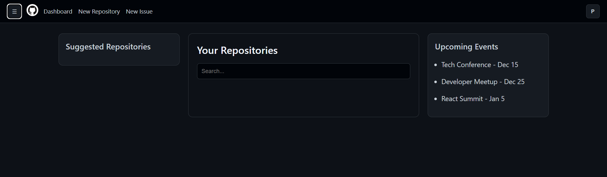
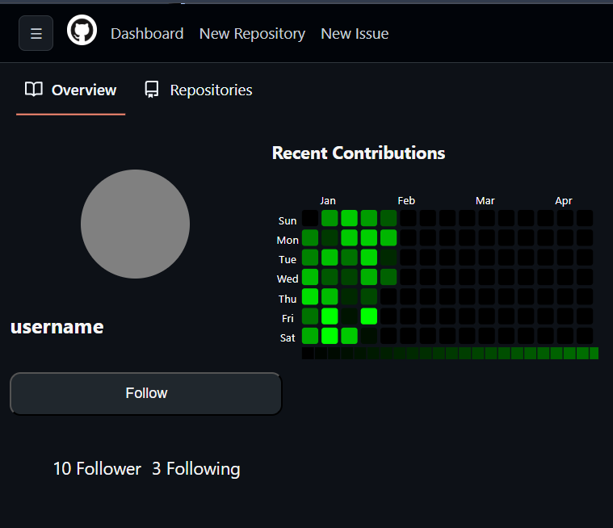

# Mini Git — Custom Version Control System

> A full-stack GitHub-style learning project that combines a **custom local VCS CLI** with a **MERN-based web platform** for users, repositories, and issue management.

## Screenshots / Demo


---

## Overview

Mini Git exists to demonstrate two ideas in one repository:

1. **How a minimal Git-like workflow can be implemented from scratch** (init, add, commit, push, pull, revert), backed by a local `.apnaGit` directory and optional S3 sync.
2. **How a GitHub-inspired product surface can be built with MERN** (user auth, repositories, issues, dashboards, profile UI).

This project is useful for students and early-stage teams who want to understand both:
- low-level version-control primitives, and
- full-stack product development patterns in JavaScript.

---

## Key Features

### Custom VCS CLI (Node + yargs)
- `init` creates `.apnaGit` metadata and commit storage.
- `add <file>` stages files into `.apnaGit/staging`.
- `commit <message>` snapshots staged files into a unique commit directory (UUID).
- `push` uploads commit artifacts to S3.
- `pull` fetches commit artifacts from S3 into local repo state.
- `revert <commitID>` restores files from a historical commit.

### Backend API (Express + MongoDB)
- User authentication: signup/login with JWT + password hashing.
- CRUD endpoints for users, repositories, and issues.
- Repository visibility toggling and user-scoped repository queries.
- Socket.IO connection scaffold for real-time collaboration extensions.

### Frontend (React + Vite)
- Auth flow (signup/login) with persistent user session in local storage.
- Dashboard with:
  - current user repositories,
  - suggested repositories,
  - client-side repository search.
- Profile page with user fetch + contribution heatmap visualization.
- Primer React UI components for GitHub-like interface conventions.

---

## Tech Stack

### Frontend
- React 18
- Vite 5
- React Router 6
- Axios + Fetch
- Primer React / Primer CSS
- `@uiw/react-heat-map`

### Backend
- Node.js + Express
- MongoDB (native driver + Mongoose)
- JWT (`jsonwebtoken`)
- `bcryptjs`
- Socket.IO
- AWS SDK (S3)
- yargs (CLI command parsing)

### Data & Infra
- MongoDB (primary app data)
- AWS S3 (commit artifact storage for push/pull workflow)

---

## Project Architecture

```text
Mini-Git-Custom-Version-Control-System/
├── backend-main/
│   ├── config/                # AWS and infrastructure config
│   ├── controllers/           # API controllers + VCS command handlers
│   ├── middleware/            # Auth/authorization middleware (scaffold)
│   ├── models/                # Mongoose schemas (User/Repository/Issue)
│   ├── routes/                # Express route modules
│   ├── index.js               # Server + CLI command entry point
│   └── package.json
├── frontend-main/
│   ├── src/
│   │   ├── components/        # Auth, dashboard, profile, navbar UI
│   │   ├── Routes.jsx         # Application route definitions
│   │   ├── authContext.jsx    # Auth state context
│   │   └── main.jsx           # React entry point
│   └── package.json
└── README.md
```

### Runtime Flow (High-Level)
1. Backend entry point accepts CLI commands **or** starts HTTP server.
2. Frontend calls REST endpoints on backend (`http://localhost:3002/...`).
3. Auth tokens and user IDs are stored client-side for session continuity.
4. Repository/issue data is persisted in MongoDB.
5. CLI push/pull uses S3 object storage for commit synchronization.

---

## Installation & Setup

## Prerequisites
- Node.js 18+
- npm 9+
- MongoDB instance (local or cloud)
- AWS account + S3 bucket (for push/pull CLI commands)

## 1) Clone repository

```bash
git clone <your-repo-url>
cd Mini-Git-Custom-Version-Control-System
```

## 2) Install dependencies

```bash
cd backend-main
npm install

cd ../frontend-main
npm install
```

## 3) Configure environment variables

Create `backend-main/.env`:

```env
PORT=3002
MONGODB_URI=mongodb://127.0.0.1:27017/githubclone
JWT_SECRET_KEY=replace_with_a_long_random_secret
S3_BUCKET=replace_with_your_bucket_name
AWS_ACCESS_KEY_ID=replace_with_access_key
AWS_SECRET_ACCESS_KEY=replace_with_secret_key
AWS_REGION=ap-south-1
```

---

## Usage Guide

## Start backend API server

```bash
cd backend
npm start
```

This runs:
```bash
node index.js start
```

## Start frontend

```bash
cd frontend
npm run dev
```

Open Vite URL (typically `http://localhost:5173`).

## Use the custom VCS CLI

Run these from **backend** (or with path-qualified `node backend-main/index.js ...`):

```bash
# Initialize repository metadata
node index.js init

# Stage a file
node index.js add path/to/file.txt

# Commit staged files
node index.js commit "Initial snapshot"

# Push commits to S3
node index.js push

# Pull commits from S3
node index.js pull

# Revert to a commit
node index.js revert <commit-id>
```

---

## API Endpoints

Base URL: `http://localhost:3002`

### User
- `GET /allUsers`
- `POST /signup`
- `POST /login`
- `GET /userProfile/:id`
- `PUT /updateProfile/:id`
- `DELETE /deleteProfile/:id`

### Repository
- `POST /repo/create`
- `GET /repo/all`
- `GET /repo/:id`
- `GET /repo/name/:name`
- `GET /repo/user/:userID`
- `PUT /repo/update/:id`
- `PATCH /repo/toggle/:id`
- `DELETE /repo/delete/:id`

### Issue
- `POST /issue/create`
- `PUT /issue/update/:id`
- `DELETE /issue/delete/:id`
- `GET /issue/all`
- `GET /issue/:id`

---


